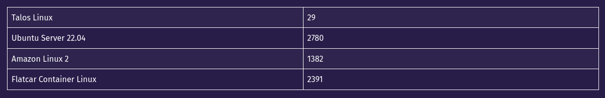

[.title]
= Kubernets braucht kein SSH

Einführung in Talos Linux

image::https://www.talos.dev/images/logo.svg[heigth=200px,width=200px]

:revealjs_theme: black
// :customcss: custom.css
:revealjs_history: true
:icons: font
// 20 minutes
:revealjs_totalTime: 1200
:source-highlighter: highlight.js
:highlightjs-languages: yaml
:revealjs_transition: slide
:revealjs_width: 1200
:revealjs_pdfseparatefragments: false

[%notitle]
== Whoami

[source,yaml]
----
$ cat whoami.yaml

apiVersion: v1
kind: Human
metadata:
  name: Felix Peters
  namespace: Stuttgart
spec:
  job: Operations Engineer
  social: @flxptrs@chaos.social
----

// 🛠️ Operations Engineer +
// 🐘 @flxptrs@chaos.social

// == Einführung in Talos Linux
// * Kurze Übersicht über Talos Linux
// * Zweck und Ansatz als Betriebssystem speziell für Kubernetes
// * Wichtige Unterschiede zu traditionellen Linux-Distributionen

== Umfrage

🙋 Umfrage: Wer betreibt ein K8S Cluster und mit welcher Distro?

== Was ist eigentlich Talos Linux?

> Talos Linux is Linux designed for Kubernetes - secure, immutable, and minimal.

=== Imutable und minimalistisches Design
* Unveränderliche Infrastruktur erhöht die Sicherheit und vereinfacht die Wartung
* Entfernt unnötige Komponenten für ein leichtgewichtiges System

// https://www.siderolabs.com/blog/there-are-only-12-binaries-in-talos-linux/

=== Automatisierte Updates

> Upgrades use an A-B image scheme in order to facilitate rollbacks. 

* Gewährleistung von Stabilität und Sicherheit mit atomaren Updates
* Reduziert den operativen Aufwand und vereinfacht das Patch-Management

=== Securtiy 
* Containerisierte, wenige Binaries und eingeschränkte Zugriffsmethoden
* Kein interaktiver Shell-Zugriff, was die Sicherheit in Produktionsumgebungen erhöht
* mTLS gesicherte API

=== API-gesteuerte Verwaltung
* Verwaltung von Talos-Knoten über eine REST-API anstelle von SSH
* Erleichtert die Automatisierung (z.B. im Vergleich zu Ansible)
* Deklarative Konfiguration

> talosctl health -e 10.410.10.42

== Vorteile von Talos Linux als Kubernetes-Distribution

* 👍 Talos reduziert Komplexität, indem es den traditionellen SSH-Zugang entfernt
* 👍 Vereinfachte Verwaltung und Konfiguration der K8S-Nodes
* 👍 Unveränderliches, minimalistisches Design
* 👍 Weniger Angriffsflächen und konsistenter Zustand auf allen Nodes

== Demo

image::https://www.talos.dev/v1.8/talos-guides/interactive-dashboard/interactive-dashboard-1_hu5c6238998f712ca49a3ada2264edd8e9_275479_920x920_fit_catmullrom_3.png[]

* Einrichten eines Talos-Clusters
* talosctl
* Troubelshooting

== Fazit und Fragen